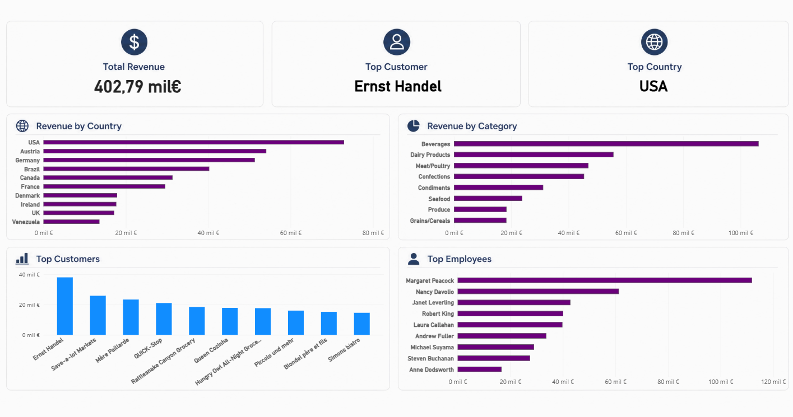

NORTHWIND BUSINESS ANALYSIS

Business analysis project developed using SQL, Python, Pandas and Power BI.

PROJECT GOALS

The objective of this project is to analyze sales data from the Northwind database and identify:

.Top customers

.Best-performing categories

.Top employees by revenue

.Revenue distribution by country

TECHNOLOGIES USED

-SQL

-Python

-Pandas

-Matplotlib

-Power BI

-Seaborn

PROJECT STRUCTURE

-queries.py → SQL queries

-analysis.py → KPI calculations

-graphics.py → Data visualization

-reports.py → Automated report generation

-dashboard.pbix → Interactive dashboard

DASHBOARD PREVIEW

## Dashboard Preview

